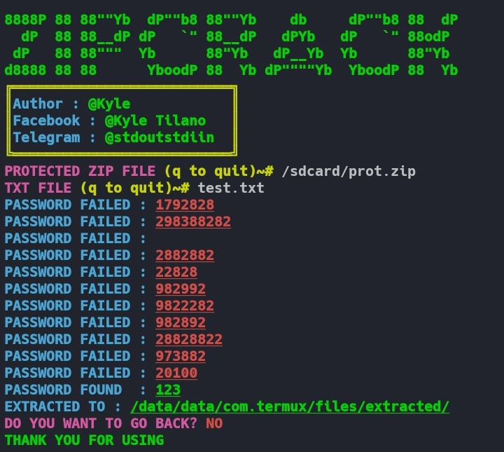

# **ZIP CRACKER**
**BRUTEFORCE A ENCRYPTED ZIP FILE**
> [!NOTE]
> ONLY WORKS ON TERMUX
# **Installation**
``bash
cd $HOME &&
git clone https://github.com/Kairu-bit/ZipCracker.git &&
cd ZipCracker &&
chmod +x install.sh &&
./install.sh &&
node main.mjs
``
# **Screenshot**

